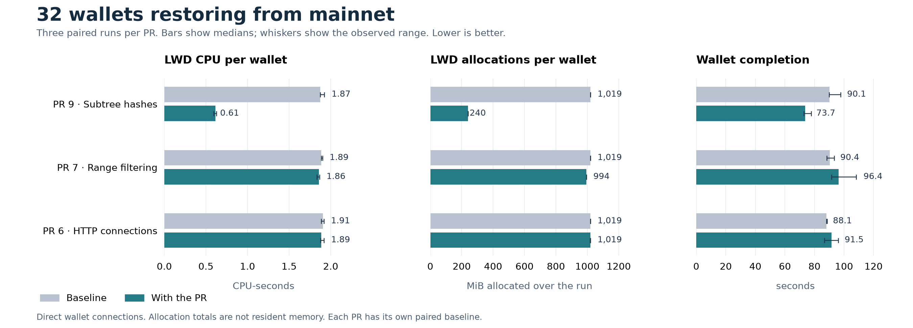

# 32 wallets restoring from mainnet

**Prioritize [PR 9, reuse subtree block hashes](https://github.com/valargroup/lightwalletd/pull/9), for servers handling wallet restores.** Across three paired runs with 32 actual wallets, it reduced lightwalletd CPU per wallet by **67%**, cumulative allocations by **76%**, and median wallet completion time from **90.1 to 73.7 seconds**. All wallets completed. The improvement appeared in every pair.

This measures wallets restoring 20,423 blocks with missing subtree metadata against a complete mainnet block cache. It does not establish the same benefit for already-synced wallets or a production server's maximum capacity.

## Which changes are worth taking

Each row compares one PR with its own baseline. Percentages compare the medians of three runs per version. The primary runs used direct connections without the RPC recorder.

| PR | LWD CPU per wallet | LWD allocations per wallet | Median wallet completion | Recommendation for this workload |
| --- | ---: | ---: | ---: | --- |
| [9 · Subtree hashes](https://github.com/valargroup/lightwalletd/pull/9) | 1.873 → 0.613 CPU-s (**-67.3%**) | 1,019 → 240 MiB (**-76.5%**) | 90.14 → 73.71 s (**-18.2%**) | Clear measured win; prioritize this change. |
| [7 · Range filtering](https://github.com/valargroup/lightwalletd/pull/7) | 1.887 → 1.859 CPU-s (-1.5%) | 1,019 → 994 MiB (-2.5%) | 90.44 → 96.42 s (+6.6%) | Small allocation saving, no restore speedup. Hold off on recommending it for speed. |
| [6 · HTTP connections](https://github.com/valargroup/lightwalletd/pull/6) | 1.908 → 1.887 CPU-s (-1.1%) | 1,019 → 1,019 MiB (-0.01%) | 88.14 → 91.53 s (+3.8%) | No convincing cached-restore improvement. |

PR 7's wallet times were longer in all three pairs; PR 6's were longer in two. These runs do not isolate the cause of those elapsed-time differences. The observed ranges are in the chart and structured results; neither change should be presented as a wallet speedup.

[PR 8](https://github.com/valargroup/lightwalletd/pull/8) changes raw backend hex decoding, and [PR 10](https://github.com/valargroup/lightwalletd/pull/10) changes mempool snapshot handling. This cached, unfunded restore did not exercise those paths. PR 10 is a correctness change, with no performance credit from these tests.

[PR 11](https://github.com/valargroup/lightwalletd/pull/11) remains useful when subtree-completing blocks are **uncached**. Its [separate repeated one-wallet report](2026-09-05-mainnet-wallet-repeats.md) measured 57m 28s → 1m 39s. That is a different configuration and is not the expected payoff on a fully cached server. The combined bundle had only a screening run; these results do not establish that a bundle beats PR 9 alone.

## What each wallet did

We ran the actual Vizor wallet sync core, with 32 distinct disposable, unfunded wallets starting together. Each run copied the same untouched starting databases. Each wallet restored from birthday **3,450,000** through mainnet height **3,470,422**.

1. Fetch missing subtree roots and their completing-block hashes. These let the wallet initialize its commitment-tree metadata.
2. Download and scan **20,423 real blocks**, using the wallet's own requests: ten **2,000-block** ranges and one **423-block** range, requesting the shielded pools.
3. Perform its normal tip, tree-state and transparent-UTXO queries and finish sync at the expected height.

A completed wallet made 40 RPCs. There was no fabricated request mix, tight fixed-range loop or public-server load test. The backend served a frozen copy of real mainnet state so both versions returned the same data.

The wallet requested 1,128 Sapling, 769 Orchard and two Ironwood subtree roots. Those requests came from the wallet itself; we did not remove older-pool requests. This was a restore with missing metadata, not a simulation of routine tip polling, funded transaction retrieval, mempool observation or spending.

## Why PR 9 helps

The baseline decodes an entire cached compact block to read the hash used in a subtree response. Many restoring wallets ask for the same hashes. PR 9 retains each hash after its first lookup, so subsequent requests reuse it. Each measured server started with an empty in-memory hash map; the cohort shared entries filled during that run.

The saving also appeared in Orchard requests. In the separate recorded 32-wallet screening comparison, the median time to return the **769 Orchard roots** fell from **4.29 to 0.40 seconds**. This is one recorded comparison, not a three-repeat estimate or an Orchard-only wallet test.

PR 9 adds a shared hash map under the cache locking rules and clears it on reorg or reset. Its existing tests cover concurrent reads, reorg invalidation and the uncached fallback. Recorded wallet responses matched the baseline exactly. The performance runs used a fixed chain, so they do not themselves exercise a live reorg.

## PR 9 results and variability

Values are **median (minimum–maximum)** across three runs per version. For wallet completion, each run contributes its median across 32 wallets. Those wallets are not 96 independent experiments. CPU-seconds measure processor work; allocation totals measure memory allocated over time, not memory retained.

| Measurement | Baseline | PR 9 |
| --- | ---: | ---: |
| Median wallet completion, seconds | 90.14 (89.90–97.70) | 73.71 (72.88–77.76) |
| All 32 wallets complete, seconds | 94.32 (92.80–98.31) | 74.11 (73.89–78.93) |
| LWD CPU per wallet, CPU-seconds | 1.873 (1.872–1.924) | 0.613 (0.595–0.626) |
| LWD allocations per wallet, MiB | 1,018.99 (1,018.98–1,019.32) | 239.69 (239.61–239.71) |
| Sampled peak LWD resident memory, MiB | 156.35 (152.74–163.69) | 146.12 (119.38–146.88) |

The allocation saving is large; the sampled resident-memory saving is much smaller. The backend's CPU cost stayed roughly unchanged. Wallet scanning also uses client CPU, which is why a 67% server CPU reduction is not a 67% reduction in total restore time.

| Pair | Order | Baseline median wallet time | PR 9 median wallet time | Baseline LWD CPU/wallet | PR 9 LWD CPU/wallet |
| --- | --- | ---: | ---: | ---: | ---: |
| 1 | PR 9 → baseline | 97.701 s | 72.875 s | 1.873 CPU-s | 0.595 CPU-s |
| 2 | Baseline → PR 9 | 89.905 s | 77.756 s | 1.924 CPU-s | 0.613 CPU-s |
| 3 | PR 9 → baseline | 90.139 s | 73.713 s | 1.872 CPU-s | 0.626 CPU-s |

Test conditions, recorder checks and evidence

- Dedicated eight-vCPU, 16 GiB server. LWD used two CPUs with GOMAXPROCS=2; Zakura used four; the recorder and sampler used the remaining two. No importer, build or OS update ran during measurements.
- Zakura 1.3.1, revision `5f1e123679357f2c96c5dc6641347091f62bd170`, archive mode, no peers. The fixed tip was 3,470,422, hash `000000000073dfbd7bf192181f1f0e060ef3c4f295504ca1c513fa49ce6b3723`. Backend-specific results should not automatically be generalized to Zebra or zcashd.
- A full genesis-to-tip cache contained 3,470,423 records. Every record checksum, height link and cumulative tree size passed verification. Cache-file sizes and modification times were unchanged through all measurements. Cache preparation and verification were outside the timed tests.
- LWD restarted between runs; its in-memory hash map started empty. Operating-system page caches and backend caches were not flushed. These are comparisons using a populated server cache, not cold-disk startup tests.
- Wallet revision `24258dcdc354b5b492bd8eb69fe92c026f55554f`. All wallet processes ran on the same 28-logical-CPU, 96 GiB Mac Studio through the same SSH tunnel. The primary PR 9 cohorts used about 1,706–1,723 client CPU-seconds each. Elapsed times include wallet scanning and client contention and are not predictions for a geographically distributed mobile fleet.
- Baseline `d79cd1100575ff909d70e00d5514a4092df94934`; PR 9 `c6ca3d123c3a07dff0c41cf6e91f1660e7e6e7c8`; PR 7 `42a2f6526e89c7fac24a3388b8f73487b7bc8db9`; PR 6 `cd4c0be79c06426169622b11aa6125daa1e3e761`. Binary SHA-256 values were checked before runs and are retained in the evidence.
- All 35 screening, primary and recorder-check runs passed validation: **968 completed wallet sessions**, including 576 sessions in the 18 primary runs. None of these runs was discarded. Separate recorded runs covered 256 sessions and matched request parameters, message counts, byte counts and response SHA-256 digests. The direct runs checked completed wallet state, delivered block counts, fixed tip, process identity and complete resource capture without interposing the recorder.
- Per-process counters and quarter-second sampling covered entire runs. CPU totals include small setup/finish margins; peak resident memory is sampled. There were no process identity changes or missing capture windows.

Recorder checks at 32 wallets used PR 9. Their elapsed-time differences were variable, so the primary results above use direct connections. These checks do not establish a fixed recorder overhead bound.

| Pair | Direct median wallet time | Recorded median wallet time | Difference |
| --- | ---: | ---: | ---: |
| 1 | 75.264 s | 76.625 s | +1.81% |
| 2 | 76.904 s | 77.252 s | +0.45% |
| 3 | 71.714 s | 79.643 s | +11.06% |

Earlier uncached runs affected by an OS update and an incomplete eight-wallet uncached baseline are separate diagnostics, excluded from these cached results. The first cached startup attempt failed before a server or wallet measurement began; its replacement passed. No failures were omitted from the 35-run cached comparison set.

[Structured results](2026-09-05-cached-wallet-repeats.json),
[raw measurements and operator scripts](2026-09-05-cached-wallet-repeats-evidence.tar.gz),
[artifact checksums](2026-09-05-cached-wallet-repeats-manifest.json),
[SVG chart](2026-09-05-cached-wallet-repeats.svg).
The evidence archive contains no wallet databases, wallet secrets or funded-wallet data.

