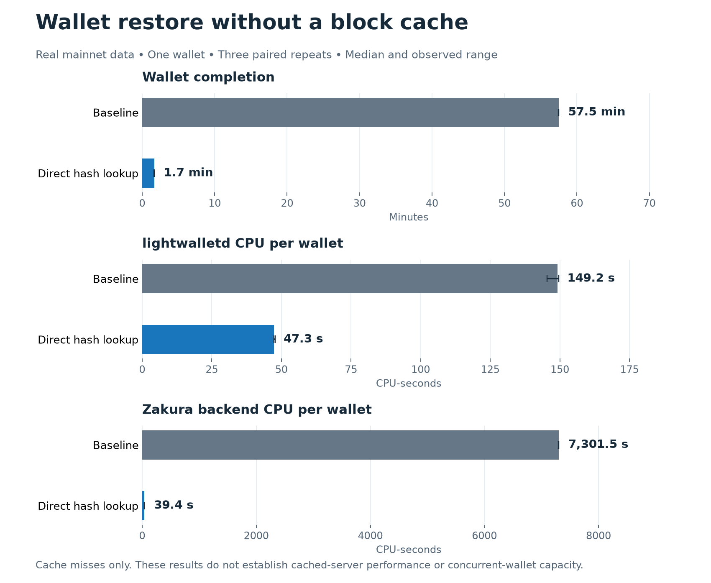

# Wallet restore without a block cache

[PR 11](https://github.com/valargroup/lightwalletd/pull/11) reduced the median
completion time for one real mainnet wallet restore from **57m 28s to 1m 39s**
across three paired repeats. lightwalletd used **68% less CPU per wallet**.
Both versions returned matching recorded responses and reached the expected tip.

**This result applies to uncached completing blocks.** These runs used the
supported `--nocache` configuration. They do not measure normal cached serving
or establish how many concurrent wallets a production server can support.

## Measured results

Values are median (observed minimum–maximum), across three runs per version.
CPU-seconds sum processor time across cores; they are not elapsed time.
Total allocations count memory allocated over the whole run, not memory held at once.

| Measurement | Baseline | Direct hash lookup | Change |
| --- | ---: | ---: | ---: |
| Wallet completion | 3,448.15 s (3,444.56–3,449.91) | 99.39 s (98.25–100.01) | -97.1% |
| lightwalletd CPU per wallet | 149.23 CPU-s (145.45–149.62) | 47.31 CPU-s (47.26–47.80) | -68.3% |
| Zakura CPU per wallet | 7,301.54 CPU-s (7,296.04–7,303.70) | 39.36 CPU-s (39.31–39.56) | -99.5% |
| Total LWD allocations per wallet | 52.52 GiB (52.52–52.52) | 10.28 GiB (10.28–10.28) | -80.4% |
| Sampled peak LWD resident memory | 45.08 MiB (40.76–46.56) | 27.68 MiB (26.93–35.12) | -38.6% |

## What the wallet did

An actual Vizor wallet restored from birthday 3,450,000 to mainnet height
3,470,422. It fetched its missing subtree roots: 1,128 Sapling, 769 Orchard and
two Ironwood. It then downloaded and scanned 20,423 blocks in ten 2,000-block
ranges and one 423-block range, with its normal tree-state and tip requests.
The unfunded wallet also queried transparent UTXOs. No artificial request mix
or repeated fixed-range loop was used.

The baseline downloads each uncached subtree-completing block merely to obtain
its hash. This change asks the backend for the hash directly. Each candidate run
replaced 3,798 full-block RPCs with 1,899 hash RPCs. The 40,846 full-block RPCs
needed for the actual block downloads remained unchanged. Benefits are not
limited to Sapling: the same path serves Orchard and Ironwood roots.

## Repeatability and recorder overhead

| Pair | Run order | Baseline wallet time | Candidate wallet time |
| --- | --- | ---: | ---: |
| 1 | Candidate → baseline | 3449.910 s | 100.012 s |
| 2 | Baseline → candidate | 3444.564 s | 99.390 s |
| 3 | Candidate → baseline | 3448.151 s | 98.246 s |

The same candidate wallet was also run directly through the SSH tunnel and
through the RPC recorder in three alternating pairs. These checks cover one
wallet only; recorder overhead under concurrent load is not established.

| Pair | Direct connection | Through recorder | Elapsed-time difference |
| --- | ---: | ---: | ---: |
| 1 | 98.832 s | 98.568 s | -0.27% |
| 2 | 99.329 s | 100.221 s | +0.90% |
| 3 | 100.143 s | 101.605 s | +1.46% |

## Test conditions and evidence

- Fixed mainnet archive, Zakura 1.3.1 backend, no peers, finalized tip 3,470,422.
  Tip hash `000000000073dfbd7bf192181f1f0e060ef3c4f295504ca1c513fa49ce6b3723`.
- Eight dedicated vCPUs and 16 GiB RAM. LWD used CPUs 0–1 with GOMAXPROCS=2;
  the node used CPUs 2–5; the recorder and sampler used CPUs 6–7. The cache
  importer performed no cache construction during the measurement windows.
- Each run copied the same immutable disposable wallet database. The actual
  Vizor sync core ran on the Mac Studio through the same SSH tunnel. Wallet
  revision `24258dcdc354b5b492bd8eb69fe92c026f55554f`.
- Baseline `d79cd1100575ff909d70e00d5514a4092df94934`; candidate
  `bdc603c9176b468281a551490cff06f34b894a45`. Binary hashes, fixed tip,
  process IDs and start times were checked. All recorded runs matched their
  request parameters, response counts, byte counts and response SHA-256 digests.
- Process sampling covered each complete wallet run, including the small setup
  and finish margins. CPU figures use each process's own cumulative counters;
  no cross-host clock alignment or background-CPU subtraction was assumed.
  Peak RSS is sampled. Backend memory and filesystem caches were not flushed.
- An earlier series interrupted by an automatic OS update was excluded. These
  replacement runs used the updated OS with automatic update restarts suppressed.
  The last two overhead pairs used a graceful importer checkpoint after a pause
  exposed an HTTP timeout; the six primary comparison runs were unaffected.

[Structured results](2026-09-05-mainnet-wallet-repeats.json),
[raw measurements and operator scripts](2026-09-05-mainnet-wallet-repeats-evidence.tar.gz),
[artifact checksums](2026-09-05-mainnet-wallet-repeats-manifest.json),
[SVG chart](2026-09-05-mainnet-wallet-repeats.svg).
The archive contains no wallet databases or wallet secrets.

## Remaining work

This establishes a repeatable improvement for this one-wallet, uncached restore
on Zakura. The [32-wallet cached-server report](2026-09-05-cached-wallet-repeats.md) now
compares PRs 6, 7 and 9 using the completed cache. Those results apply to a
different serving configuration. PR 8's raw-hex path, PR 10's mempool path and
funded relevant-transaction retrieval were not exercised by that cached restore
fixture. No upstream PR has been opened.
