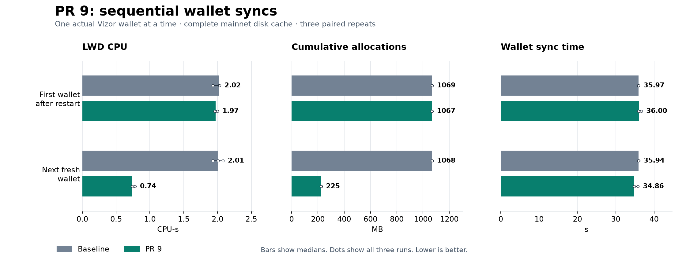

# Sequential wallet syncs

**PR 9 saves server work when wallets arrive one at a time.** For a fresh wallet arriving after one prior sync, median LWD CPU fell from **2.01 to 0.74 CPU-seconds (63.2% less)**. This repeated across three baseline/PR 9 pairs with a complete mainnet disk cache. No simultaneous wallet cohort was needed.

For the first wallet after restart, LWD CPU was **2.02 → 1.97 CPU-seconds**. That wallet fills the new hash map. Its next fresh copy can reuse those hashes.

## Results

Medians of three paired repeats per condition. Allocations are cumulative bytes allocated during serving, not retained RAM. Wallet time includes client scanning and networking.

| Server state | LWD CPU per wallet | LWD allocated bytes | Wallet sync time |
| --- | ---: | ---: | ---: |
| First wallet after restart | 2.02 → 1.97 (-2.5%) CPU-s | 1069 → 1067 (-0.1%) MB | 35.97 → 36.00 (+0.1%) s |
| Next fresh wallet, same process | 2.01 → 0.74 (-63.2%) CPU-s | 1068 → 225 (-79.0%) MB | 35.94 → 34.86 (-3.0%) s |

On this hardware, the warm case avoided **1.27 CPU-seconds of LWD work per fresh sync**. A provider can use this to understand the cost of repeated wallet bootstraps. The production percentage still depends on hardware, wallet behavior, history size, and how much traffic is fresh syncs versus other requests. It is not a measurement of total production CPU or maximum server capacity.

Wallet completion stayed close to the baseline. These results support a reduction in server work; they do not establish a noticeable speedup for a lone wallet.

The absolute LWD saving was **1.27 CPU-seconds per next wallet**, compared with **1.26 CPU-seconds per wallet** in the earlier 32-wallet comparison on the same server hardware. This supports the conclusion that the saving does not require simultaneous wallet arrivals.

## What ran

Each server process served two sequential syncs from separate copies of the same untouched disposable Vizor wallet database. The first sync filled any on-demand server caches; the second started with no saved wallet sync progress. LWD stayed running between them. Warming with one wallet was sufficient because the second requested the same complete root lists.

Both versions used the previously verified full disk cache: **3,470,423 compact-block records**, about **30.8 GB**. “After restart” means an empty process-local hash map, not an empty disk cache. We did not drop the operating system page cache. Server startup and its index read were outside the measurement windows.

The actual wallet sync core restored birthday **3,450,000** through frozen mainnet height **3,470,422**. Each wallet requested **1,899 subtree roots** (1,128 Sapling, 769 Orchard, two Ironwood) and **20,423 blocks** in ten 2,000-block ranges plus one 423-block range. These requests came from the wallet. No handcrafted RPC workload or public endpoint was used.

The six primary process runs were baseline/PR 9, PR 9/baseline, baseline/PR 9. Each had a first and next wallet: **12 measured syncs**, all without the recorder. Two additional server runs, one per version, recorded both phases for **four response-equivalence checks**. Those recorded times are excluded from the headline medians.

## Every primary pair

| Pair | Wallet | LWD CPU, baseline → PR 9 | Allocations, baseline → PR 9 | Sync time, baseline → PR 9 |
| --- | --- | ---: | ---: | ---: |
| 1 | First | 1.93 → 1.97 CPU-s | 1069 → 1068 MB | 35.84 → 36.69 s |
| 1 | Next | 1.93 → 0.74 CPU-s | 1068 → 225 MB | 35.85 → 35.83 s |
| 2 | First | 2.02 → 2.00 CPU-s | 1068 → 1067 MB | 35.99 → 36.00 s |
| 2 | Next | 2.01 → 0.74 CPU-s | 1068 → 225 MB | 36.00 → 34.86 s |
| 3 | First | 2.03 → 1.96 CPU-s | 1069 → 1067 MB | 35.97 → 35.91 s |
| 3 | Next | 2.08 → 0.78 CPU-s | 1068 → 225 MB | 35.94 → 34.83 s |

## Validation and limits

All **16 wallets completed** at the expected tip. Every phase delivered 20,423 blocks and 1,899 roots. All four recorded phases matched the prior reference exactly for RPC requests, response message counts, byte counts and response digests. LWD and node process identities remained unchanged within each run. Phase CPU and allocation deltas were independently recomputed from retained snapshots. The verified cache file sizes and modification times remained unchanged.

LWD was pinned to two logical CPUs with `GOMAXPROCS=2`; the node used four other CPUs. The real wallet client ran alone among benchmark wallets on the same Mac used in the previous report, through an SSH tunnel. It still shares that Mac with other applications. Phase CPU counters include the small interval around launching and finishing the wallet; OS accounting has 10 ms resolution. Wallet elapsed time comes from the wallet process, excluding server startup.

For the next-wallet condition, node CPU was 0.27 → 0.28 (+3.7%) CPU-s, and wallet client CPU was 49.57 → 49.29 (-0.6%) CPU-s. The structured results retain these alongside LWD counters so the server saving is not confused with wallet scanning work.

The node served frozen real mainnet state. These tests do not measure live chain advancement, a reorg, funded transaction retrieval, spending, or routine sync by a wallet that already holds its subtree metadata. The existing cache tests cover reorg invalidation; this experiment measures restart and reuse behavior.

## Revisions and evidence

- Baseline: `d79cd1100575ff909d70e00d5514a4092df94934`.
- PR 9: `c6ca3d123c3a07dff0c41cf6e91f1660e7e6e7c8`.
- Backend: Zakura `1.3.1+g5f1e12367935`, executable SHA-256 `f37369563be71ecf050418d8ede477b37087d834b280337385e946757e30408c`.
- Mainnet tip hash: `000000000073dfbd7bf192181f1f0e060ef3c4f295504ca1c513fa49ce6b3723`.
- Wallet executable SHA-256: `bc02379bf56e8ac2fd494c8bb9f6660bce90ad77220e05077cb462d76ef0def1`.
- [Structured results](2026-09-05-single-wallet-cache.json), [raw evidence and operator scripts](2026-09-05-single-wallet-cache-evidence.tar.gz), [SHA-256 manifest](2026-09-05-single-wallet-cache-manifest.json). Wallet databases and secrets are excluded.
- [Previous 32-wallet comparison](2026-09-05-cached-wallet-repeats.md).
